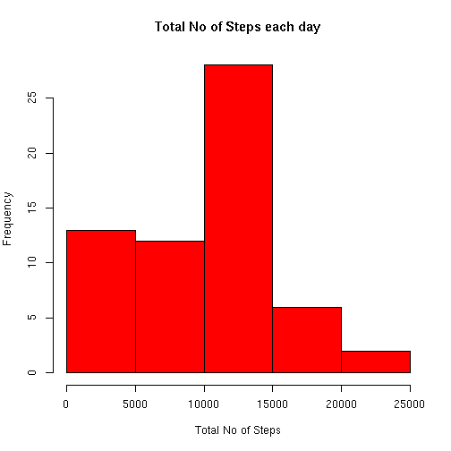
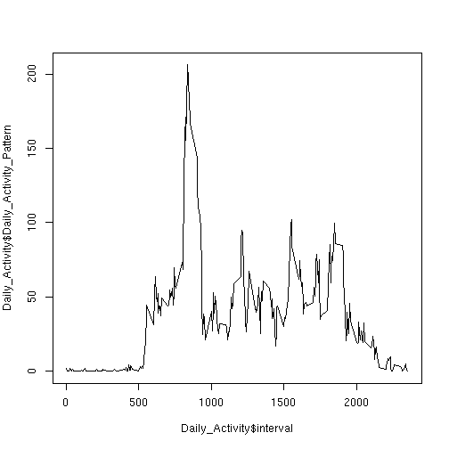
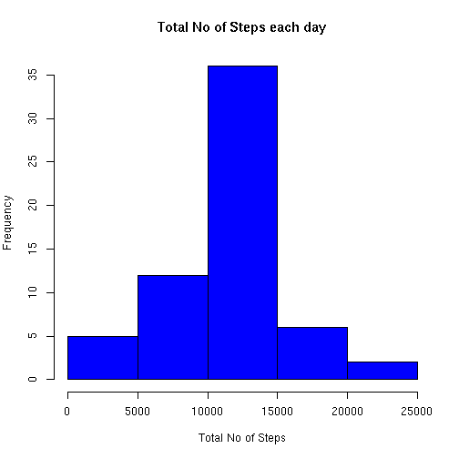
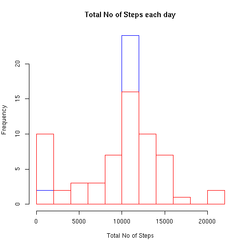
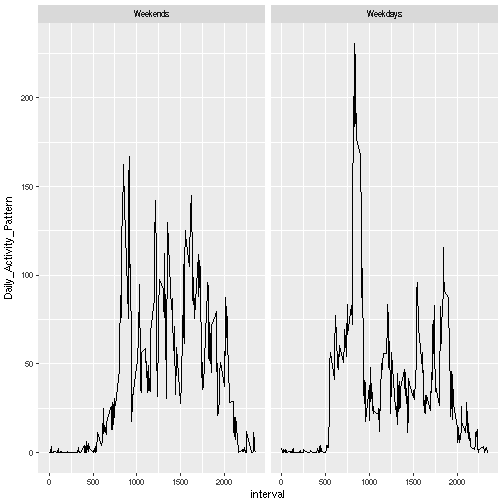

## Reading Data


```r
unzip("activity.zip")
activity <- read.csv("activity.csv")
str(activity)
```

```
## 'data.frame':	17568 obs. of  3 variables:
##  $ steps   : int  NA NA NA NA NA NA NA NA NA NA ...
##  $ date    : Factor w/ 61 levels "2012-10-01","2012-10-02",..: 1 1 1 1 1 1 1 1 1 1 ...
##  $ interval: int  0 5 10 15 20 25 30 35 40 45 ...
```
## Total No of Steps
### Mean Total No. of Steps taken each day

```r
library(dplyr)
Steps <- activity %>% group_by(date) %>% summarise(Total_steps = sum(steps,na.rm = T))
Steps
```

```
## # A tibble: 61 × 2
##          date Total_steps
##        <fctr>       <int>
## 1  2012-10-01           0
## 2  2012-10-02         126
## 3  2012-10-03       11352
## 4  2012-10-04       12116
## 5  2012-10-05       13294
## 6  2012-10-06       15420
## 7  2012-10-07       11015
## 8  2012-10-08           0
## 9  2012-10-09       12811
## 10 2012-10-10        9900
## # ... with 51 more rows
```
### Histogram of Total No of steps each day

```r
hist(Steps$Total_steps, main = "Total No of Steps each day", xlab = "Total No of Steps", col = "red")
```



### Mean No of Total Steps each day

```r
mean(Steps$Total_steps)
```

```
## [1] 9354.23
```
### Median No of Total Steps each day

```r
median(Steps$Total_steps)
```

```
## [1] 10395
```
## Daily Activity Pattern
### Average Daily Activity Pattern

```r
Daily_Activity <- activity %>% group_by(interval) %>% summarise(Daily_Activity_Pattern = mean(steps,na.rm = T))
plot(x = Daily_Activity$interval,y = Daily_Activity$Daily_Activity_Pattern,type = "l" )
```


### Maximum Steps Interval

```r
Daily_Activity[(which.max(Daily_Activity$Daily_Activity_Pattern)),]
```

```
## # A tibble: 1 × 2
##   interval Daily_Activity_Pattern
##      <int>                  <dbl>
## 1      835               206.1698
```
## Imputing Missing Values
### Total No of Missing Values = 2304

```r
summary(activity)
```

```
##      steps                date          interval     
##  Min.   :  0.00   2012-10-01:  288   Min.   :   0.0  
##  1st Qu.:  0.00   2012-10-02:  288   1st Qu.: 588.8  
##  Median :  0.00   2012-10-03:  288   Median :1177.5  
##  Mean   : 37.38   2012-10-04:  288   Mean   :1177.5  
##  3rd Qu.: 12.00   2012-10-05:  288   3rd Qu.:1766.2  
##  Max.   :806.00   2012-10-06:  288   Max.   :2355.0  
##  NA's   :2304     (Other)   :15840
```
### Strategy for imputing missing values
Since missing values are present only in steps
So, substitue the steps with average number of steps for that interval
### Imputing the missing values and creating a new dataset

```r
Avg_no_of_steps <- activity %>% group_by(interval) %>% summarise (steps_treated = mean(steps,na.rm = T))
Treated_activity <- left_join(activity, Avg_no_of_steps, by.x = activity$interval, by.y = Avg_no_of_steps$interval)
```

```
## Joining, by = "interval"
```

```r
for (i in 1:length(Treated_activity$steps))
  {
  if(is.na(Treated_activity$steps[i]))
    {
    Treated_activity$steps[i] <- Treated_activity$steps_treated[i]
    }
  }
Treated_activity$steps_treated = NULL
summary(Treated_activity)
```

```
##      steps                date          interval     
##  Min.   :  0.00   2012-10-01:  288   Min.   :   0.0  
##  1st Qu.:  0.00   2012-10-02:  288   1st Qu.: 588.8  
##  Median :  0.00   2012-10-03:  288   Median :1177.5  
##  Mean   : 37.38   2012-10-04:  288   Mean   :1177.5  
##  3rd Qu.: 27.00   2012-10-05:  288   3rd Qu.:1766.2  
##  Max.   :806.00   2012-10-06:  288   Max.   :2355.0  
##                   (Other)   :15840
```
###
### Histogram of Total No of steps each day by Treated dataset

```r
Treated_Steps <- Treated_activity %>% group_by(date) %>% summarise(Treated_Total_steps = sum(steps))
hist(Treated_Steps$Treated_Total_steps, main = "Total No of Steps each day", xlab = "Total No of Steps", col = "blue")
```



### Mean No of Total Steps each day

```r
mean(Treated_Steps$Treated_Total_steps)
```

```
## [1] 10766.19
```
### Median No of Total Steps each day

```r
median(Treated_Steps$Treated_Total_steps)
```

```
## [1] 10766.19
```
### Comparing Untreated and treated activity

```r
hist(Treated_Steps$Treated_Total_steps, main = "Total No of Steps each day", xlab = "Total No of Steps", border = "blue", breaks = 10)
hist(Steps$Total_steps, main = "Total No of Steps each day", xlab = "Total No of Steps",border = "red" ,breaks = 10, add = T)
```


### Differnce in mean and median of treated and untreated data

```r
mean(Treated_Steps$Treated_Total_steps) - mean(Steps$Total_steps)
```

```
## [1] 1411.959
```

```r
median(Treated_Steps$Treated_Total_steps) - median(Steps$Total_steps)
```

```
## [1] 371.1887
```
## Analysis of weekday and weekend activity
### Creating Weekday and Weekend flag

```r
Treated_activity$date <- as.Date(Treated_activity$date)
Treated_activity$Day <- weekdays(Treated_activity$date)
weekends <- c("Sunday","Saturday")
Treated_activity$Day <- factor((Treated_activity$Day %in% weekends), levels = c(TRUE,FALSE), labels = c("Weekends","Weekdays"))
```
### Time Series Plot

```r
Treated_Daily_Activity <- Treated_activity %>% group_by(interval,Day) %>% summarise(Daily_Activity_Pattern = mean(steps,na.rm = T))
library(ggplot2)
ggplot(Treated_Daily_Activity,aes(x = interval, y =Daily_Activity_Pattern ), fill = Day) + geom_line() + facet_grid(.~Day)
```



<p style= "text-align:center;">Thanks</p>
